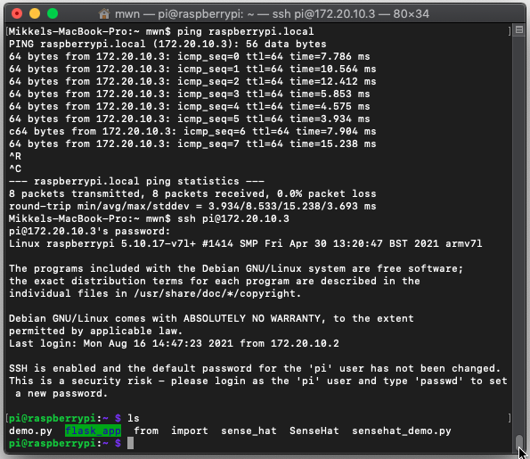

# Weather Station with Raspberry Pi and SenseHAT

## Required equipment

- Raspberry Pi 4 Model B

- Micro SD card + card reader / adapter

- Power supply

- SenseHAT

- Wi-Fi network

## Operating system

Download and install Raspberry Pi OS using Raspberry Pi Imager from https://www.raspberrypi.org/software/

Under Operating System, choose Other and Raspberry PiOS Lite (with no desktop environment).

Under Storage, choose the SD card from the KEA Tech Lounge Kit (must be plugged in your PC).

Select Write to create the Operating System (OS) image for Raspberry Pi on the SD card.

## Configuration files

The first step is to create a SSH configuration file named "ssh" to enable SSH for remote access to the Raspberry Pi and make a network configuration file named "wpa_supplicant.conf" for the Raspberry Pi to access a local Wi-Fi network.

The SSH file should just be empty with no file extension and when the Raspberry Pi is booted (turned on), the operating system will register the SSH file and SSH will be enabled on the Raspberry Pi. 

The network configuration file for Wi-Fi access enables the Raspberry Pi to connect to a local Wi-Fi network and we recommend using your mobile phone to share its Internet. It is important that there are no spaces in your mobile phone's Wi-Fi name and password.

```
country=DK
ctrl_interface=DIR=/var/run/wpa_supplicant GROUP=netdev
update_config=1
network={
  ssid="your_wifi_name"
  psk="your_wifi_password"
}
```

These two configuration files should be transferred to the SD card before booting up the Raspberry Pi and you can see on your mobile phone if another device is connected to your Internet sharing when booted up.

Link: https://www.raspberrypi.org/documentation/computers/remote-access.html

## Booting and remote access

The Raspberry Pi should now be plugged into power and turned on. When it boots up it will have the Raspberry Pi OS installed, SSH enabled, and connected to a local Wi-Fi network using a mobile phone.

Next step is to ping the Raspberry Pi to get its IP address and therefore the computer must also be connected to the same local Wi-Fi network as the Raspberry Pi.

Open the Terminal on Mac or Command Prompt on Windows and write “ping raspberrypi.local”. For example:

```
ping raspberrypi.local
64 bytes from 172.20.10.1 ...
```

We can now use this IP address to access the Raspberry Pi using SSH so write “ssh pi@ip-address”. For example:

```
ssh pi@172.20.10.1
```

The standard username is “pi” and the standard password is “raspberry”. Be aware to change this.

When connected to the Raspberry Pi it is possible to use regular commands to work with its file system.

```
ls
```



## Visual Studio Code Remote Development using SSH

Documentation: https://code.visualstudio.com/docs/remote/ssh

Tutorial: https://code.visualstudio.com/docs/remote/ssh-tutorial

## Updating packages on the Raspberry Pi

The sudo apt-get update command is used to download package information from all configured sources.

```
sudo apt-get update
sudo apt-get upgrade
```

Then install SenseHAT package.

```
sudo apt-get install sense-hat
sudo reboot
```

Run the apt list --installed command to see all modules installed on the Raspberry Pi.

```
apt list --installed
```

## First Python script

To begin writing our new Python script run the following command in terminal.

```
sudo nano ~/main.py
```

Add the following code to the Python script using Visual Studio Code Remote Development.

```
#!/usr/bin/python
from sense_hat import SenseHat
import time
import sys
sense = SenseHat()
sense.clear()

try:
  while True:
    temp = sense.get_temperature()
    temp = round(temp, 1)
    print("Temperature C", temp)
    humidity = sense.get_humidity()
    humidity = round(humidity, 1)
    print("Humidity :", humidity)
    pressure = sense.get_pressure()
    pressure = round(pressure, 1)
    print("Pressure:", pressure)
    time.sleep(1)
    
except KeyboardInterrupt:
  pass
```

Run the following command in the Terminal to run the script.

```
sudo python3 ~/main.py
```

The following text should appear in your terminal if everything is working as it should be.

```
('Temperature C', 30.0)
('Humidity :', 39.8)
('Pressure:', 1025.7)
```
